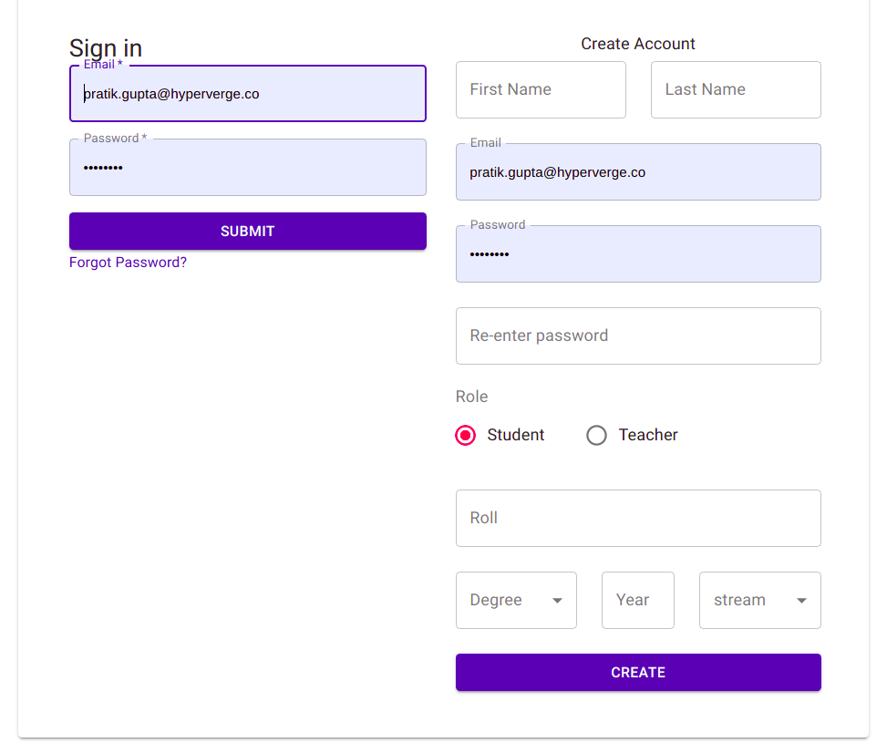
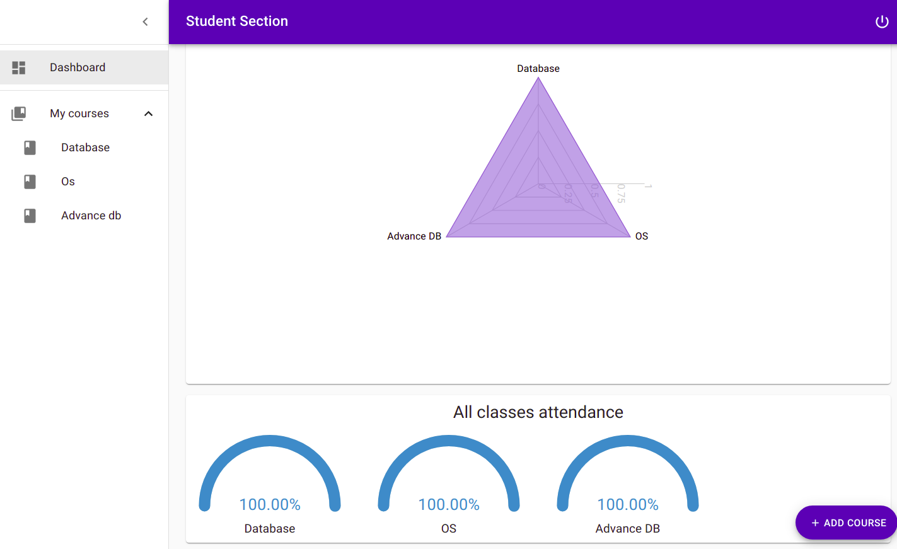
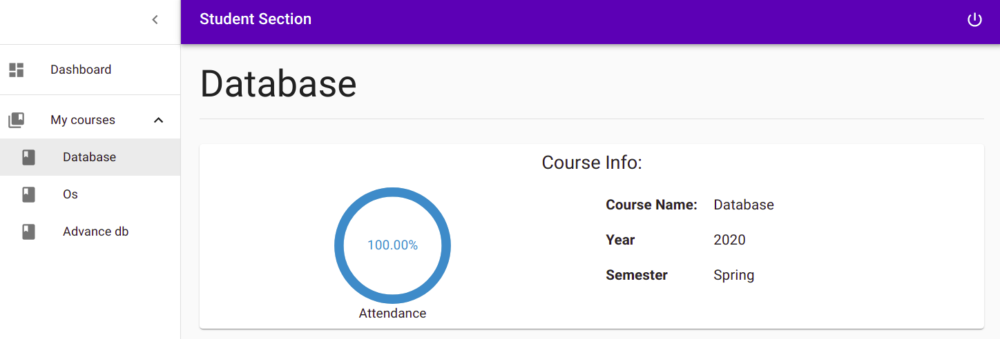
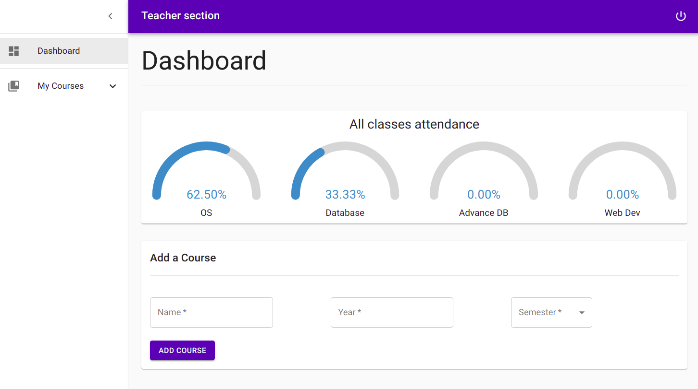
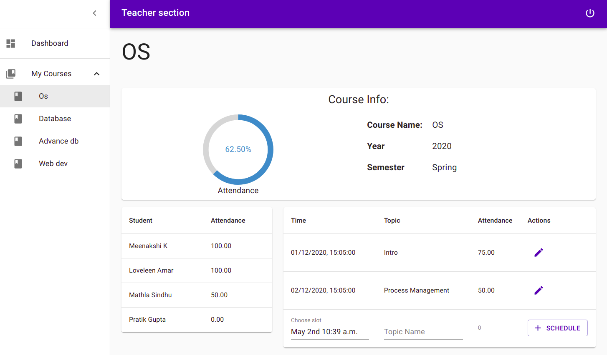

# Student MIS system

Frontend for Student MIS system for student/teacher enrollment, course registration, classes and attendance management.

_Backend repo: [link](https://github.com/pratikg1999/attendance-system-backend)_

## Instructions to get started-
* Clone the backend repo (link given above) and start the backend server. Contact the author for this.
* Clone this repo
* Run `npm install` to install the node dependencies
* Run `npm start` to start the react server in development mode
* Go to `localhost:3000` on browser to start using the app

## Screenshots
**Login screen**

**Student Dashboard**

**Student Course**

**Teacher Dashboard**

**Teacher Course**

